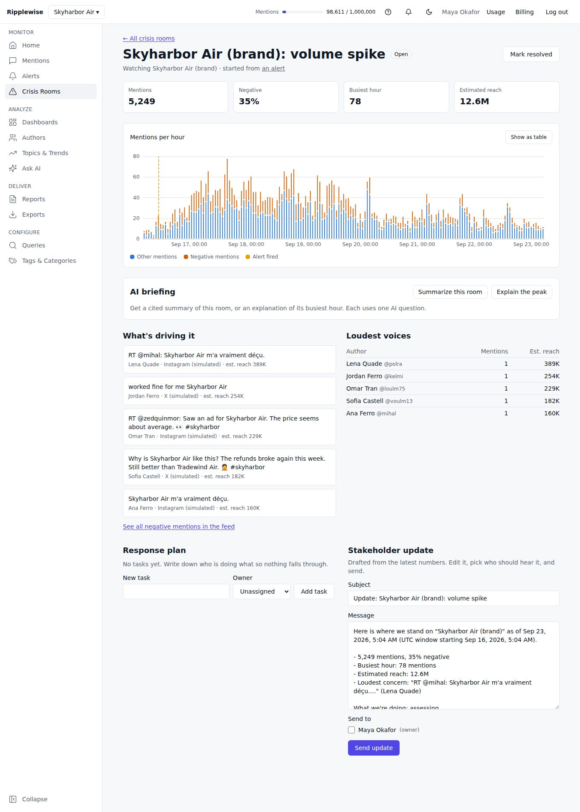
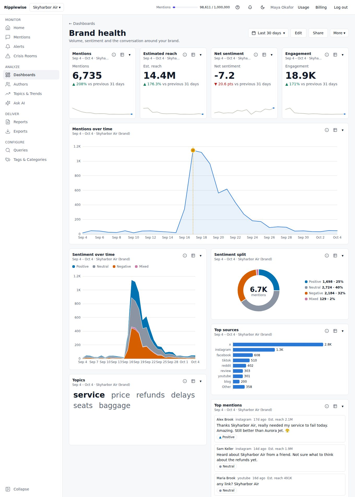
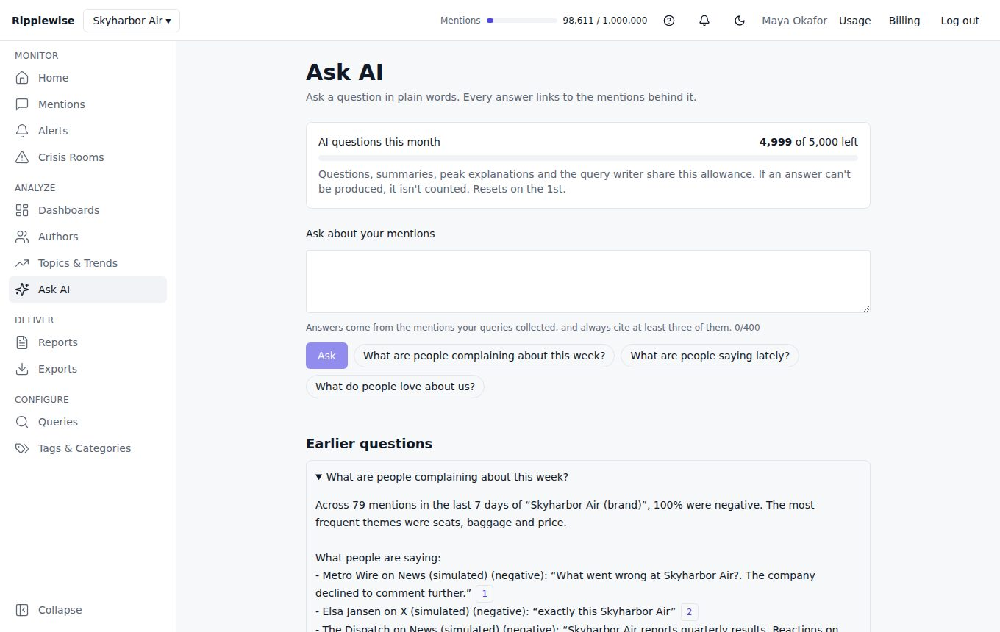

# social_listening
A social listening platform made up of synthetic autonomous agents users and mention's authors.

## What it is

Ripplewise is a fictitious B2B social listening product: it watches public conversation about a brand, tells the team when something is happening, and helps them explain it. It is built as a real product (onboarding, plans and limits, roles, billing states, alerts, reports, an AI assistant, an analytics plan) rather than a demo, and every external service in it is simulated and labelled as such. All data is synthetic.

Start with [docs/product.md](docs/product.md) for the product thinking: the problem, the decisions behind it, how it measures itself, and what is unfinished. To see it work, follow the [20-minute guided tour](docs/tour.md).

<picture>
  <source media="(prefers-color-scheme: dark)" srcset="docs/screenshots/07-crisis-room-dark.jpg">
  
</picture>

<picture>
  <source media="(prefers-color-scheme: dark)" srcset="docs/screenshots/05-dashboard-dark.jpg">
  
</picture>

<picture>
  <source media="(prefers-color-scheme: dark)" srcset="docs/screenshots/09-ask-ai-dark.jpg">
  
</picture>

All screens, in light and dark, are in [docs/screenshots](docs/screenshots). They are regenerated with `npm run screenshots`, which builds a demo account through the real interface (so it also checks that the flows still work).

More detail: [AI](docs/ai.md) · [Auth](docs/auth.md) · [Billing](docs/billing.md) · [Teams and audit log](docs/teams.md) · [Reports](docs/reports.md) · [Authors and Topics](docs/insights.md) · [Sales and scoring](docs/sales.md) · [Query language](docs/query-language.md) · [Data generation](docs/datagen.md)

## Development
```
cp .env.example .env.local          # then set AUTH_SECRET
docker compose up -d postgres mailpit
npm install
npm run db:migrate                  # app + corpus tables
npm run datagen && npm run db:load  # ~1 min + ~2 min: 4.1M synthetic mentions (see docs/datagen.md)
npm run dev                         # http://localhost:3000  (signup -> verify via /inbox -> onboarding)
```
Checks: `npm run typecheck && npm run lint && npm test && npm run test:contrast && npm run test:e2e`
(set `PW_CHROMIUM_PATH` to use a pre-installed Chromium). See CLAUDE.md for the build brief and milestones.
